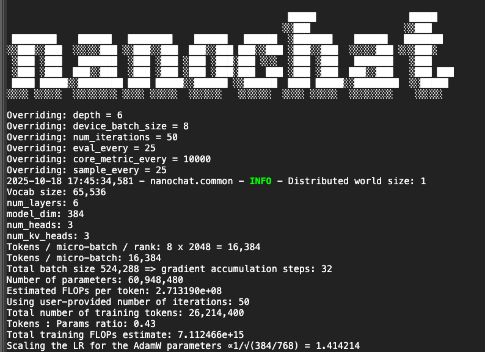

# NanoChat on Google Colab T4

Training GPT-style language models on free Google Colab T4 GPU.

## 🎯 What This Is

A complete guide to training a small language model (37M-60M parameters) using Andrej Karpathy's [nanochat](https://github.com/karpathy/nanochat) on free Google Colab resources.

## ✅ What Works

- ✅ Full training pipeline on T4 (16GB VRAM)
- ✅ Data persists on Google Drive
- ✅ Base model training + Chat fine-tuning
- ✅ Interactive chat interface
- ✅ WandB logging integration

## 📊 Training Results

**Base Model (depth=4, 37M params):**
- Training time: ~2-3 hours on T4
- Final validation bpb: 1.79
- Memory usage: ~6GB VRAM

**Chat Model (SFT):**
- Training time: ~30-45 mins
- MMLU accuracy: 27%
- ARC-Easy accuracy: 24%

## 🚀 Quick Start

[Full instructions in blog post](YOUR_MEDIUM_LINK)

## 📝 Blog Post

Read the detailed guide: [Training Your Own ChatGPT on Free Google Colab](YOUR_MEDIUM_LINK)

## 📈 WandB Logs

- [Base Training Run](YOUR_WANDB_LINK)
- [SFT Training Run](YOUR_WANDB_LINK)

## 🙏 Credits

Built on [nanochat](https://github.com/karpathy/nanochat) by Andrej Karpathy
